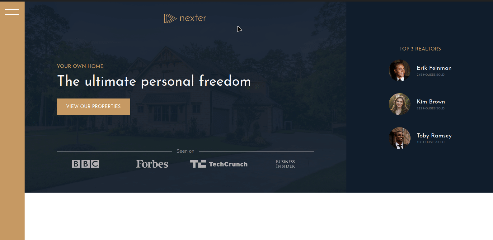

# Nexter-frontend
##### Live site: https://gadgetvala.github.io/Nexter-frontend/

Simple Website Template.



### Installation

Nexter-frontend requires [Node.js](https://nodejs.org/) v4+ to run.

Install the dependencies and devDependencies and start the server.

```sh
$ cd Nexter-frontend
$ npm install
$ npm start
```

### Development

Want to contribute? Great!
Just fork the repository and create a pull request with your ideas.

License
----
**Free Software, Hell Yeah!**
